# Advanced Lane Detection

Advanced Lane Detection consists of the following steps:
1. Camera calibration
2. Distortion correction
3. Color/gradient threshold
4. Perspective transform
5. Detect lane lines
6. Determine the lane curvature

## Camera Calibration
### Finding chessboard corners, Drawing detected corners on an image
### Camera calibration, Undistorting a test image
## Perspective Transform

A perspective transform maps the points in a given image to different, desired, image points with a new perspective. The perspective transform you’ll be most interested in is a bird’s-eye view transform that let’s us view a lane from above; this will be useful for calculating the lane curvature later on. Aside from creating a bird’s eye view representation of an image, a perspective transform can also be used for all kinds of different view points.

### Undistort and Transform Perspective

    Undistort the image using cv2.undistort() with mtx and dist
    Convert to grayscale
    Find the chessboard corners
    Draw corners
    Define 4 source points (the outer 4 corners detected in the chessboard pattern)
    Define 4 destination points (must be listed in the same order as src points!)
    Use cv2.getPerspectiveTransform() to get M, the transform matrix
    use cv2.warpPerspective() to apply M and warp your image to a top-down view

Please refer the section on Pipeline for the resulst on Camera calibarion and undistorting a test image

## Gradient Threshold, Sobel Operator

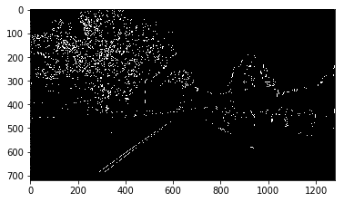

## HLS and Color Thresholds
Here I'll read in the same original image (the image above), convert to grayscale, and apply a threshold that identifies the lines:

    Original Image

    Gray Thresold

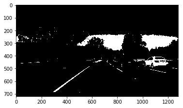

    H Gray

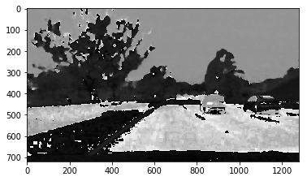

    L Gray

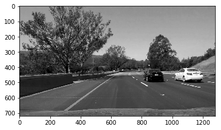

    S Gray

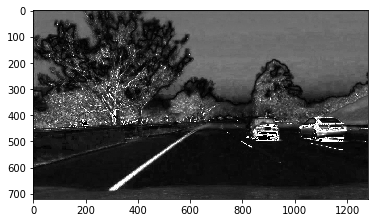

    S binary

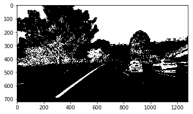

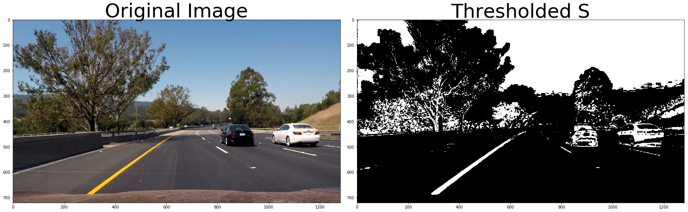

## Processing Each Image: Pipeline
### Thresholding

I tried out try out various combinations of color and gradient thresholds to generate a binary image where the lane lines are clearly visible.

### Perspective Transform for straight lines

Next, I want to identify four source points for your perspective transform. In this case, you can assume the road is a flat plane. This isn't strictly true, but it can serve as an approximation for this project. I would like to pick four points in a trapezoidal shape (similar to region masking) that would represent a rectangle when looking down on the road from above.

The easiest way to do this is to investigate an image where the lane lines are straight, and find four points lying along the lines that, after perspective transform, make the lines look straight and vertical from a bird's eye view perspective

### Perspective Transform for curved lines

Those same four source points will now work to transform any image (again, under the assumption that the road is flat and the camera perspective hasn't changed). When applying the transform to new images, the test of whether or not you got the transform correct, is that the lane lines should appear parallel in the warped images, whether they are straight or curved.

Here's an example of applying a perspective transform to your thresholded binary image, using the same source and destination points as above, showing that the curved lines are (more or less) parallel in the transformed imag

## Line Finding Method: Peaks in a Histogram

After applying calibration, thresholding, and a perspective transform to a road image, you should have a binary image where the lane lines stand out clearly. However, you still need to decide explicitly which pixels are part of the lines and which belong to the left line and which belong to the right line.

I first take a histogram along all the columns in the lower half of the image

## Implement Sliding Windows and Fit a Polynomial

Suppose you've got a warped binary image called binary_warped and you want to find which "hot" pixels are associated with the lane lines. Here's a basic implementation of the method shown in the animation above. You should think about how you could improve this implementation to make sure you can find the lines as robustly as possible!

## Measuring Curvature

You're getting very close to a final result! You have a thresholded image, where you've estimated which pixels belong to the left and right lane lines (shown in red and blue, respectively, below), and you've fit a polynomial to those pixel positions. Next we'll compute the radius of curvature of the fit.

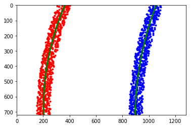

## Tracking

After you've tuned your pipeline on test images, you'll run on a video stream, just like in the first project. In this case, however, you're going to keep track of things like where your last several detections of the lane lines were and what the curvature was, so you can properly treat new detections. To do this, it's useful to define a Line() class to keep track of all the interesting parameters you measure from frame to frame. Here's an example:

## Sanity Check

Ok, so my algorithm found some lines. Before moving on, you should check that the detection makes sense. To confirm that your detected lane lines are real, you might consider:

## Smoothing

Even when everything is working, your line detections will jump around from frame to frame a bit and it can be preferable to smooth over the last n frames of video to obtain a cleaner result. Each time you get a new high-confidence measurement, you can append it to the list of recent measurements and then take an average over n past measurements to obtain the lane position you want to draw onto the image.

## Drawing

Once you have a good measurement of the line positions in warped space, it's time to project your measurement back down onto the road! Let's suppose, as in the previous example, you have a warped binary image called warped, and you have fit the lines with a polynomial and have arrays called ploty, left_fitx and right_fitx, which represent the x and y pixel values of the lines. You can then project those lines onto the original image as follows:

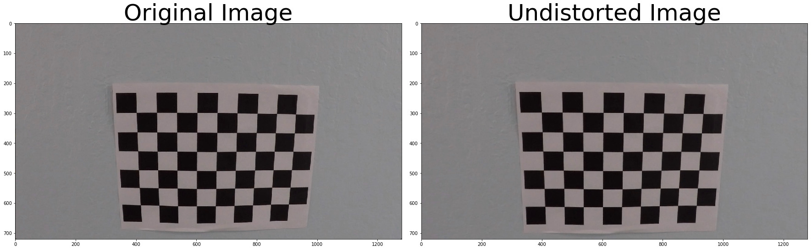

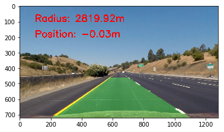

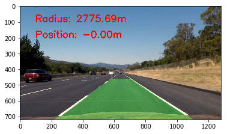

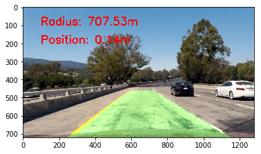

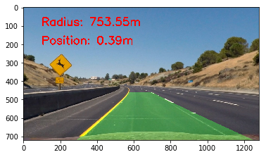

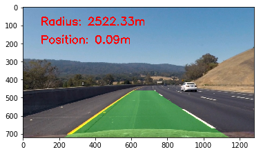

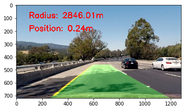

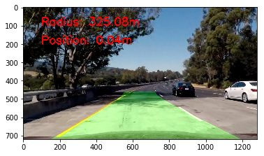

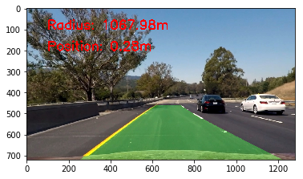

## Video Output
The processed video was saved as project_vide_out.mp4 with the overlay of the radius of curvature, position of teh vehivle with respect to the center of the lane and the overlay of the detected lane polynomial fit.

## Discussion
Overall the advanced lane detection logic detected the lanes. Very few frames where the road had shadows with addional different surface changes the logic was missing detection. This was corrected by doing sanity check for valid range of position of vehicle and valid range of radius and the last know good value.
